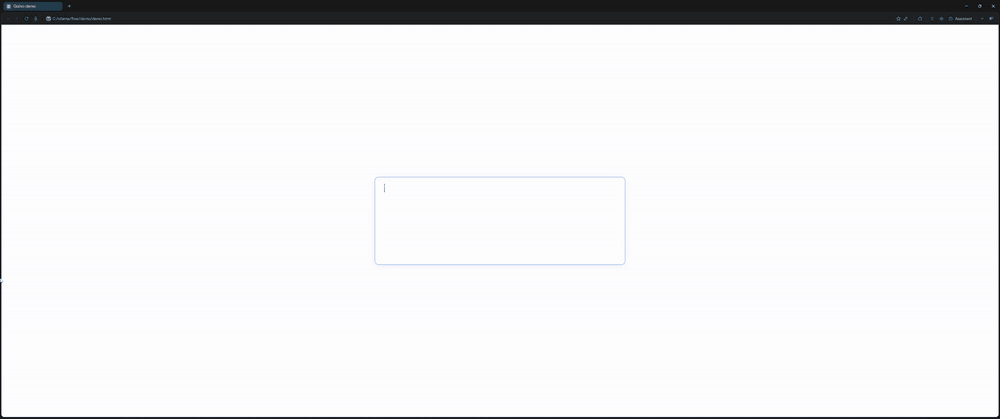

# Quilvo



Local voice dictation for Windows. Press **Alt+PageDown** anywhere, speak, press it again — the text is typed into whatever field your cursor is in. Speech recognition runs on your own PC with [faster-whisper](https://github.com/SYSTRAN/faster-whisper); nothing you say leaves your computer.

- **Works in any app:** browser, chat, editor, email.
- **About 100 languages.** Pick the ones you speak; with English + Spanish you can even mix both in one sentence.
- **Blue edge glow** around the screen that reacts to your voice while you speak.
- **Model picker:** a "dynamic island" at the top of the screen. Hover it to switch speech models or turn on optional text cleanup with a local LLM ([Ollama](https://ollama.com) or [LM Studio](https://lmstudio.ai)).
- **No models bundled:** the default speech model downloads automatically on first run. Others download when you pick them.

## Install

1. Download `Quilvo-<version>-win64.zip` from [Releases](../../releases) and unzip it to a folder you'll keep, like `Documents\Quilvo`.
2. Run `Quilvo.exe`.
   - Windows may show *"Windows protected your PC"* because the app isn't code-signed. Click **More info → Run anyway**.
3. On first run Quilvo downloads its speech models (about 560 MB). A notification tells you when it's ready.
4. Optional: right-click the tray icon → **Start with Windows**.

Requirements: Windows 10/11 (64-bit) and a microphone. No GPU needed; transcription runs on the CPU.

## Use

| Action | How |
|---|---|
| Start dictating | **Alt+PageDown** |
| Stop and insert the text | **Alt+PageDown** again |
| Cancel | **Esc** |
| Change languages or models | Hover the island at the top of the screen while dictating |

### Speech models

| Model | Size | Notes |
|---|---|---|
| `small` (default) | 486 MB | Best balance of speed and accuracy |
| `tiny` | 78 MB | Used automatically to detect which of your languages you're speaking |
| `base` | 145 MB | Faster, less accurate |
| `medium` | 1.5 GB | More accurate, several times slower on CPU |
| `large-v3-turbo` | 1.6 GB | Most accurate, slow on CPU |

Models that aren't downloaded show a ⬇ icon; click one to download it (the ring shows progress). You can also pick any faster-whisper / CTranslate2 model folder with **Browse for a model folder…**.

### Languages

Hover the island → **Language → Change** and tick the languages you speak. Quilvo starts with English plus your Windows display language.

- **One language:** fastest and most accurate.
- **Several:** Quilvo detects which one you're using each time. Speech in a language you haven't ticked comes out translated into one you have, so tick every language you speak.
- **Detect any language:** works for everything, but short phrases are sometimes detected as the wrong language.

Accuracy varies by language. `small` is very good for widely spoken languages like English, Spanish, French, German, Portuguese, Italian, Chinese or Japanese. For less common languages, try `medium` or `large-v3-turbo`.

### Text cleanup (optional)

With a local LLM running in Ollama or LM Studio, pick it under **Text cleanup** and Quilvo will tidy punctuation and remove filler words ("um", "uh") before pasting. It's off by default: it adds a delay and can reword sentences. Quilvo starts Ollama in the background if it's installed but not running.

## Privacy

Audio is recorded only while dictating and is transcribed locally. Quilvo's only network use is downloading models from [Hugging Face](https://huggingface.co) and talking to Ollama / LM Studio on `127.0.0.1`.

Settings and logs live in `%APPDATA%\Quilvo` (tray → **Open log folder**). Downloaded models live in the Hugging Face cache (`%USERPROFILE%\.cache\huggingface\hub`).

## Run from source

Python 3.12+ on Windows:

```powershell
pip install -r requirements.txt
pyw flow.py            # or double-click Quilvo.bat
```

Advanced options (hotkey, languages, visual style) are constants at the top of `flow.py`.

## Build the release

```powershell
.\build.ps1            # → dist\Quilvo\Quilvo.exe and dist\Quilvo-<version>-win64.zip
dist\Quilvo\Quilvo.exe --selftest   # smoke test; results in %APPDATA%\Quilvo\flow.log
```

The build uses PyInstaller with the exact versions in `requirements-lock.txt`.

## Project layout

| File | What it is |
|---|---|
| `flow.py` | The app: hotkey, recording, transcription, paste, tray, windows |
| `models.py` | Finds installed Whisper models and local LLMs; downloads; cleanup calls |
| `edge.html` | Full-screen edge glow |
| `island.html` | The dynamic island / model picker |
| `overlay.html` | Alternative "pill" look (`STYLE = "pill"` in `flow.py`) |
| `flow.spec`, `build.ps1` | Packaging |

## License

[MIT](LICENSE)
